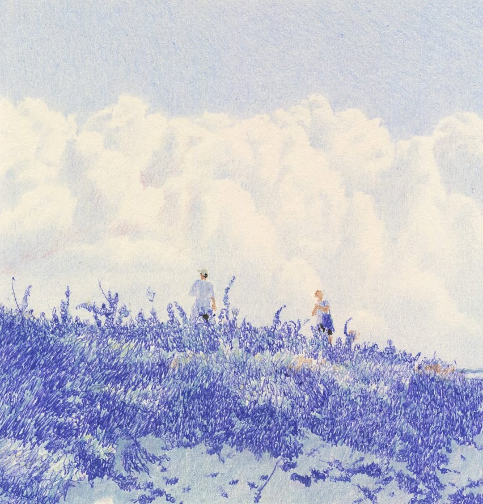

### Overview 概述

### Basic Director Notes 基础拍摄知识

**Mise-en-scène** 调度
**Staging** 单场景布景和站位
**Set** 布景
**Blocking** 角色站位
**Tone** 基调
**Lighting** 灯光
**Atmosphere** 氛围

---

### Composition 构图

#### How to consider the Composition 如何考虑构图

构图是针对单镜头画面的考量，需要
##### 1. Aspect Ratio 画幅比
- **16:9 (1.78:1, 1280\*720, 1920\*1080)** 
传统画幅比，用途最广最保险，视角偏理性客观，多用于日常叙事、纪录片和电视节目拍摄等情况。适配于普通家用电视。
- **21:9 (2.35:1, 1680\*720, 1920\*802)**
变形宽银幕，电影画幅比，视角宽广，视角偏感性和沉浸式，宏大感和叙事感强，适配需要展示宽广和孤独感场景，营造强烈氛围感叙事的情况。适配于电影院荧幕和横向手机屏幕。
- **4:3 (1.33:1, 1024\*768, 1280\*1024)**
上个世纪最通用的画幅比，整体偏向方形，视野有限且紧凑，目前多用于刻意制造复古感的情况。适配旧时家用电视。
- **9:16 (1:1.78, 720\*1280)**
竖屏，左右视野狭窄，目前多用于社交平台、直播和短剧等不需要考虑构图美感，方便普通群众即时享乐和获取信息的情况。适配于竖向手机屏幕。

##### 2. Frame 取景
- **Full Shot 全景**: 
- **Long Shot 远景**
- **Medium Shot 中景**
- **Cowboy Shot 七分景**
- **Close-up 特写**

##### 3. Focal Point 焦点变换
- **Prime Lens 定焦**: 焦距全程没有变化，一焦到底。
- **Zoom In 聚焦**: 相机不动，通过拉长焦距的方式将画面物体拉近放大。适配于需要刻意强调某物的情况下，手持相机模仿伪纪录片形式下常用。
- **Zoom Out 拉远**: 相机不动，通过缩短焦距的方式将画面物体拉远缩小。适配于从聚焦物退出的情况，常和聚焦配合出现。
- **Dolly Zoom 希区柯克变焦**: 既改变焦距又改变相机物理位置，且焦距和相机运动位置相反。比如相机本身推进，但焦距在拉远；相机本身在退后，但焦距在缩进。适用于奇妙、诡谲、异常或角色主观视角下精神模糊混乱的状况。
- **Rack Focus 变焦**: 在单一画面内，焦点从物体A转移至物体B，相对的景深也会变化。常用于镜头内需要引导观众转换关注点的情况。

##### 4. Depth of Field 焦距
- **Ultra Short Throw 超短焦**
- **Short Lens 短焦**
- **Telephoto Lens长焦**
- **微焦**
##### 5. Direction 拍摄方向
- **Top view 俯视**
- **仰视**
- **180 degree rule 轴向**
##### 6. Hot Spot 视觉热点
- **九宫格视觉点**

#### Composition Keywords 构图关键词

---

### Lighting 灯光

#### Lighting Combination 灯光组成

- **High Key** 高饱和度
- **Low Key** 低饱和度

---

